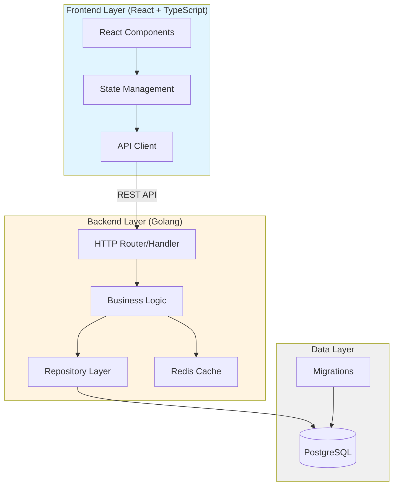

```mermaid
graph TB
    subgraph Frontend["Frontend Layer (React + TypeScript)"]
        UI[React Components]
        State[State Management]
        API_Client[API Client]
    end
    
    subgraph Backend["Backend Layer (Golang)"]
        Router[HTTP Router/Handler]
        Service[Business Logic]
        Repo[Repository Layer]
        Cache[Redis Cache]
    end
    
    subgraph Data["Data Layer"]
        DB[(PostgreSQL)]
        Migration[Migrations]
    end
    
    UI --> State
    State --> API_Client
    API_Client -->|REST API| Router
    Router --> Service
    Service --> Repo
    Service --> Cache
    Repo --> DB
    Migration --> DB
    
    style Frontend fill:#e1f5ff
    style Backend fill:#fff4e1
    style Data fill:#f0f0f0
```